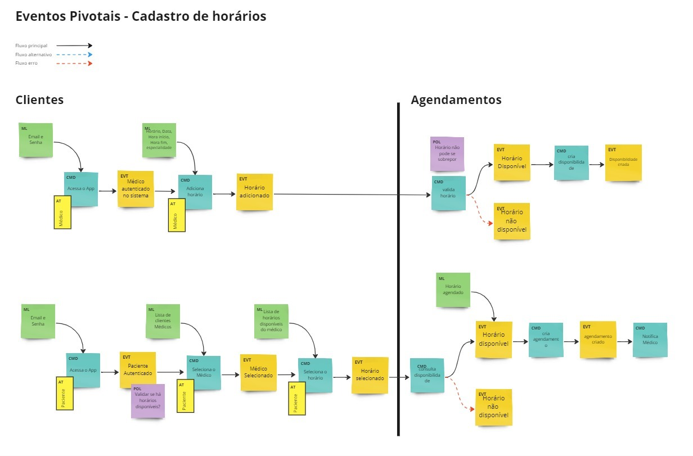
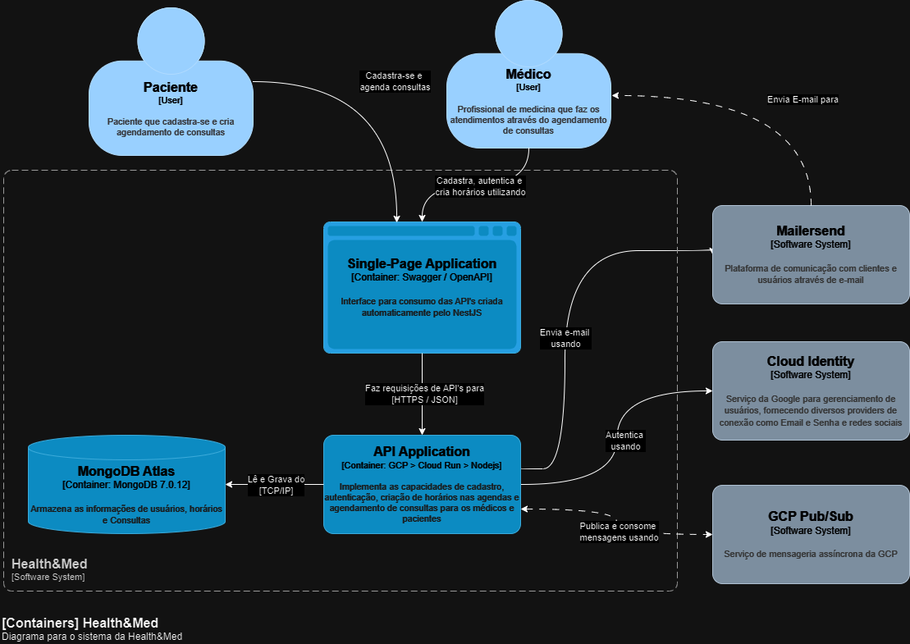
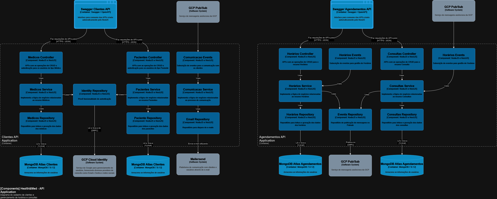
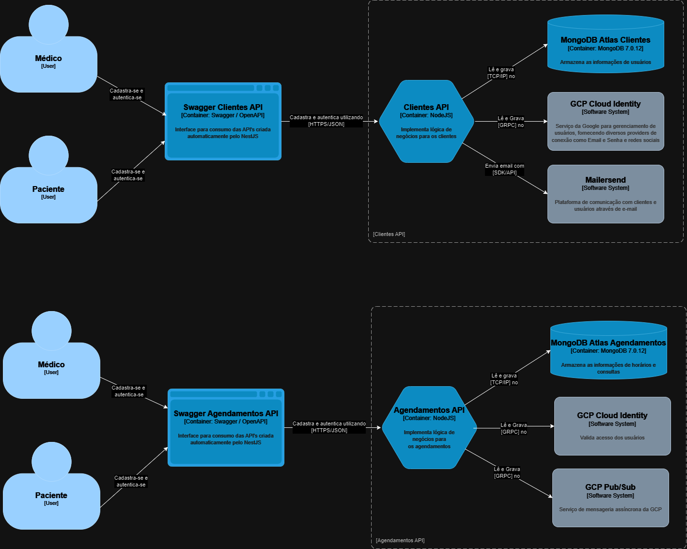
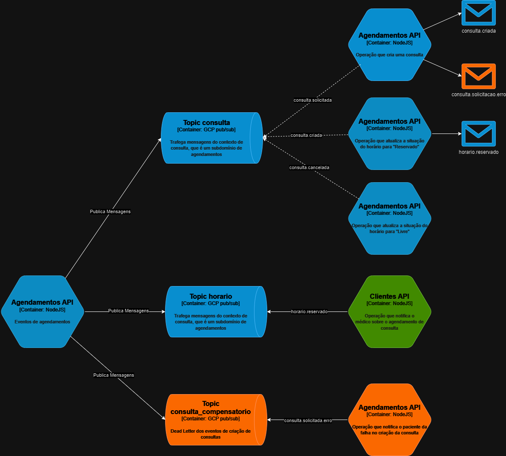
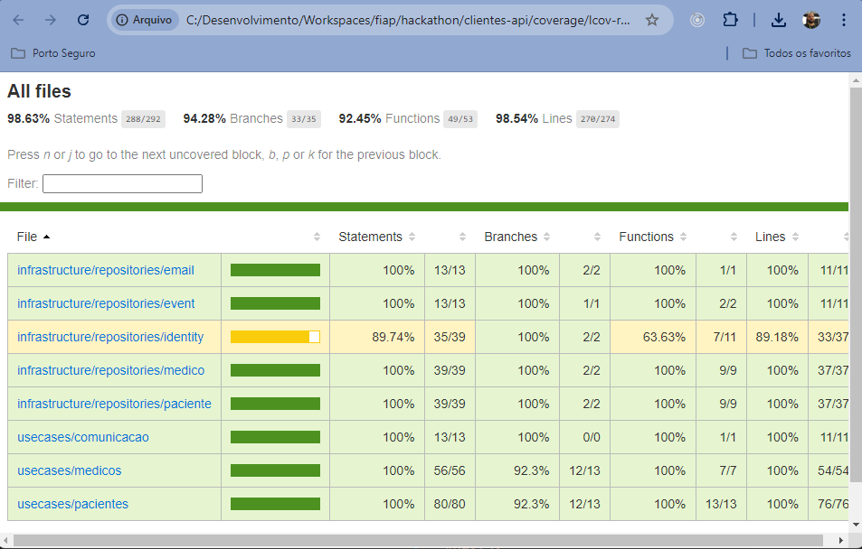
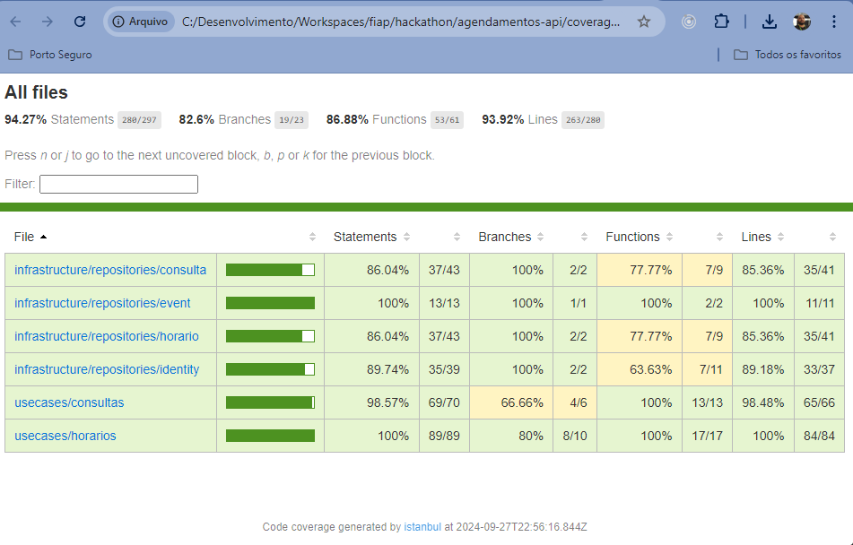

# Sistema de Agendamento da Health&Med

Este documento descreve a arquitetura do sistema de agendamento online da **HEALTH&MED**, que é uma operadora de saúde que tem como objetivo digitalizar
seus processos e operação. O principal gargalo da empresa no momento é o agendamento de consultas médicas, que atualmente ocorre exclusivamente através de
ligações para a central de atendimento da empresa.

Para resolver esse problema, a empresa investirá em um sistema proprietário, visando proporcionar um processo de Agendamentos de Consultas Médicas 100% digital e mais ágil

# Arquitetura do Sistema

## Eventos Pivotais (DDD)

## Diagrama de contexto (C1)

## Diagrama de containeres (C2)

## Diagrama de componentes (C3)

## Diagrama de microsserviços

## Diagrama de Filas e Topicos

## Software

O sistema segue uma arquitetura de microsserviços, com cada funcionalidade principal encapsulada em seu próprio serviço:

- **clientes-api:** Gerencia os dados do cliente, que possuem os perfis de Médicos e Pacientes. As principais funcionalidades são:
    - **Cadastro:** Novo cadastro de cliente e criação de perfil.
    - **Autenticação:** Login seguro e gerenciamento de sessão.
    - **Gerenciamento de Perfil:** Visualização e atualização das informações do cliente.
    - **Serviço de Notificações:** Faz a comunicação com os clientes em determinados eventos do sistema, como por exemplo um novo agendamento de consulta.
    - **Swagger / OpenAPI:** "frontend" do sistema na entrega do MVP.

    🔗 Repositório: https://github.com/fiap-5soat-grupo22/clientes-api

    🏷️ `#nodejs` `#nestjs` `#typescript` `#GCP` `#Cloud Run` `#nestjs` `#Serverless`

    🪲Cobertura de testes:
  
    

- **agendamentos-api:** Gerencia a disponibilidade de horários e agendamento de consultas. As princiapis funcionalidades são:
    - **Inclusão de horários:** Permite que os clientes com perfil de médico incluam horários disponíveis para agendamento de consultas.
    - **Agendamento de Consultas:** Permite que os clientes com perfil de paciente visualizem os horários disponíveis dos médicos e façam o agendamento das consultas.
    - **Cancelamento de Consulta:** Permite aos usuários Pacientes que cancelem as consultas agendadas.
    - **Alteração de horários:** Permite que os médicos possam alterar um horário de disponibilidade previamente cadastrado.
    - **Swagger / OpenAPI:** "frontend" do sistema na entrega do MVP.

    🔗 Repositório: https://github.com/fiap-5soat-grupo22/agendamentos-api

    🏷️ `#nodejs` `#nestjs` `#typescript` `#GCP` `#Cloud Run` `#nestjs` `#Serverless`

    🪲Cobertura de testes:
  
    

## CI/CD

Todas as aplicações são conteinerizadas e distribuídas automaticamente, após um commit no repositório, na Google Cloud Platform (GCP) através de esteiras CI/CD do GitHub (Github Actions) e utilizam-se de workflows compartilhados para ter maior padronização e facilidade de manutenção. O build & deploy acontece através da execução do CLI da GCP, que é o gcloud e também está configurado nestas esteiras, a execução de testes unitários através do `nestjs` e validação de qualidade e segurança do código através de `ESLint`

Cobertura de testes:

🔗 Repositório Workflows: https://github.com/fiap-5soat-grupo22/workflows-templates

🏷️ `#github` `#githubactions` `#gcloud` `#GCP` `#CloudRun` `#nestjs` 

Para o gerenciamento da infraestrutura que não é aplicação, como por exemplo a criação de tópicos e subscrições (utilizamos aqui o pubsub da GCP), foi utilizado o terraform e o deploy também acontece automaticamente após um commit no repositório.

🏷️ `#terraform` `#pubsub` `#EDA`
🔗 Repositório Terraform: https://github.com/fiap-5soat-grupo22/hackathon-terraform

## Benefícios desta Arquitetura

- **Escalabilidade:** Cada microsserviço pode ser escalado independentemente com base na demanda.
- **Custo:** Na abordagem de serviço em cloud serverless, incluindo a utilização do MongoDB Atlas, o custo é reduzido pois a cobrança é conforme a utilização.
- **Manutenibilidade:** Serviços menores e desacoplados são mais fáceis de entender, modificar e manter.
- **Diversidade Tecnológica:** Diferentes serviços podem utilizar diferentes tecnologias mais adequadas às suas tarefas específicas.
- **Isolamento de Falhas:** Os problemas em um serviço têm menos probabilidade de afetar outras partes do sistema.